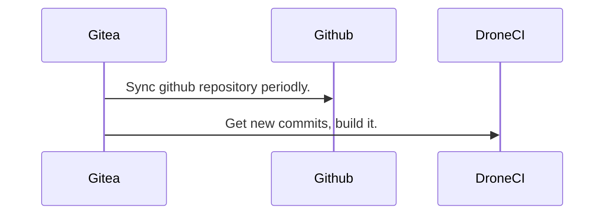

## 為什麼要自己架 Drone CI

以前的公司在 Github 權限管理比較嚴格. 我當時的權限只能做 push/pull 這些動作. 我也沒有權限可以做 Github Action.
所以決定在公司某台主機上架 Drone CI.
但 Drone CI 需要架設在 public 的環境下, 讓 Github 可以 trigger 它, 所以選擇了找了另一個折衷的方案, Gitea + Drone CI.

Gitea 能定期的 mirror Github 上面的 repository, Drone CI 也能支援 Gitea, 能達到我想要的效果.

## 為什麼不用 Jenkins?

對 Jenkins 的印象一直停留在 UI 有點慢, Jenkins 的設定頁面太複雜, Plugin 常常不相容等等的問題. 所以在架設的時候沒有列入考慮.
但 Jenkins 可以做到的事情非常的多. 現有的 Plugin 也非常的豐富.

因為我沒有要太複雜的功能. 希望很容易的可以讓 team member 使用, 所以後來選用 Drone CI.
缺點就是跟 Jenkins 比起來, 我需要多架一個 Gitea.

## Gitea

[Gitea](https://gitea.io/zh-tw/)

## Drone CI

Drone CI 有分 Enterprise 和 Open Source 兩種版本.
詳細的區別可以看[這裡](https://www.drone.io/enterprise/opensource/).

[Drone CI](https://www.drone.io/)

## 工作流程



## Build with docker-compose

當初再架設的時候是使用 Drone CI v1.10.1 的版本. 要換到 v2 應該也不會有太大的問題.

1. 準備 Drone CI (v1.10.1) 的 Dockerfile

```Dockerfile
FROM golang as go

RUN git clone https://github.com/drone/drone.git && \
    cd drone && \
    git checkout v1.10.1 && \
    go build -tags "oss nolimit" github.com/drone/drone/cmd/drone-server

VOLUME /data

ENV XDG_CACHE_HOME /data
ENV DRONE_DATABASE_DRIVER sqlite3
ENV DRONE_DATABASE_DATASOURCE /data/database.sqlite
ENV DRONE_RUNNER_OS=linux
ENV DRONE_RUNNER_ARCH=amd64

ENTRYPOINT ["/go/drone/drone-server"]
```

2. 準備 docker-compose

Gitea 有很多選項可以開關, [參考這兒](https://docs.gitea.io/en-us/config-cheat-sheet/)

```yaml
# docker-compose.yml

version: "3.8"

services:
  gitea:
    image: gitea/gitea:1.13.3
    environment:
      - USER_UID=1000
      - USER_GID=1000
    restart: always
    volumes:
      - ./data/gitea:/data
    ports:
      - 3000:3000 # for web
      - 2222:22 # for ssh

  drone:
    build: docker/droneci
    ports:
      - 3001:8080 # for web
    volumes:
      - ./data/drone:/data
    restart: always
    environment:
      - DRONE_SERVER_HOST="${DRONE_SERVER_HOST}"
      - DRONE_SERVER_PROTO=http
      - DRONE_RPC_SECRET="${DRONE_RPC_SECRET}"
      - DRONE_GITEA_CLIENT_ID="${DRONE_GITEA_CLIENT_ID}"
      - DRONE_GITEA_CLIENT_SECRET="${DRONE_GITEA_CLIENT_SECRET}"
      - DRONE_GITEA_SERVER="${DRONE_GITEA_SERVER}"
```

3. 準備 .env

```sh
# .env

# My ip address is 192.168.50.226. Change the ip to yours.

DRONE_SERVER_HOST=192.168.50.226:3001
DRONE_RPC_SECRET= # generated by `openssl rand -hex 16`
DRONE_GITEA_CLIENT_ID= # get from step 6.3
DRONE_GITEA_CLIENT_SECRET= # get from step 6.3
DRONE_GITEA_SERVER=192.168.50.226:3000
```

4. Build Drone CI image

```sh
docker-compose build
```

5. Run Gitea

```sh
docker-compose up -d gitea
```

6. 設定 gitea

   1. 點 Sign In
      
   2. 修改 database 設定, 這邊用 sqlite3
      
   3. 修改 general 設定
      
   4. 新增 admin 帳號密碼
      
   5. 點擊 Install Gitea

7. 取得 Client ID and Secret

   1. 進入設定
      
   2. 點選 Applications -> 輸入 Application Name -> 輸入 Redirect URI
      
   3. 複製 Client ID and Secret
      

8. 複製 Client ID 和 Secret 到 .env 裡面的 DRONE_GITEA_CLIENT_ID 和 DRONE_GITEA_CLIENT_SECRET

9. Run Drone CI

```sh
docker-compse up -d drone
```

10. Open DroneCI and login with Gitea account/password on browser (http://x.x.x.x:3001)

    1. 登入
       
    2. 賦予權限
       

11. 大功告成 Dashboard
    

## Final

架設的部份就到這裡. Mirror 的部份等之後有空再來發一篇.

Reference:
1. [Gitea](https://gitea.io/zh-tw/)
2. [Drone CI](https://www.drone.io/)
